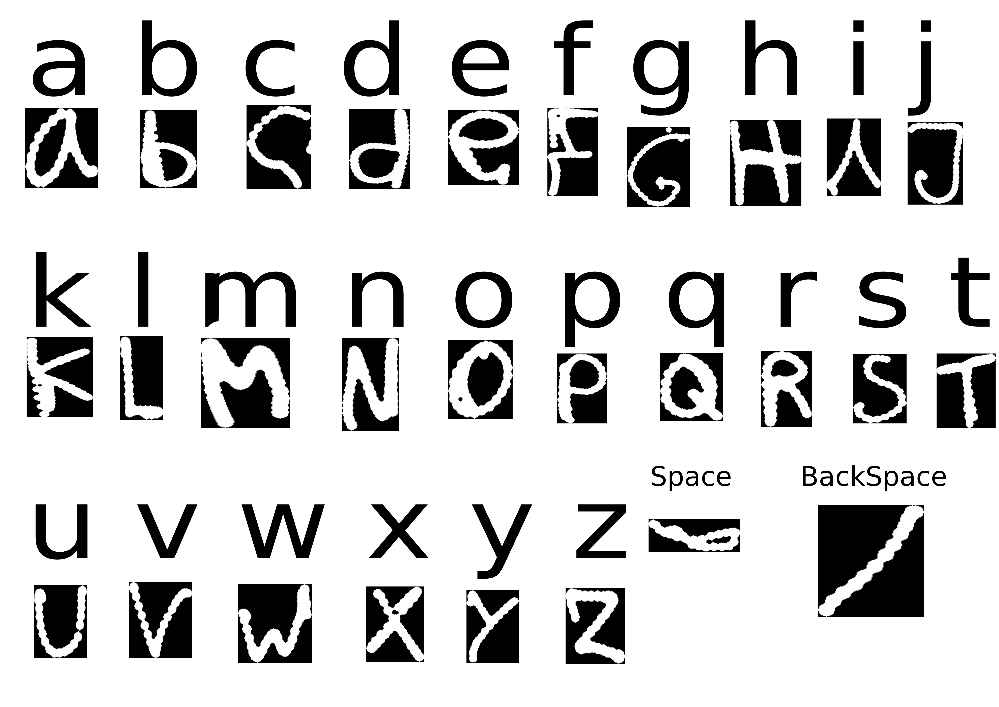

# Hand-Webcam-Write-AR
Write using just one finger!

I've used the mediapipe hand detection to train a Residual Neural Network to detect characters. Just lift your index finger to write in the air and see how it magically transforms into a character.
The project also implements a [grammar correction pipeline](https://github.com/rcabg/Spanish-Spelling-Corrector) to autocorrect misspelled although it's only available in Spanish. 

## Demo
Will be comming soon (hopefully Tuesday 2nd).

## Characters
The following image contains all possible characters the network is learnt to distinguish and some ways you can write them. Also, try to replicate the shape as much as possible for better results.

